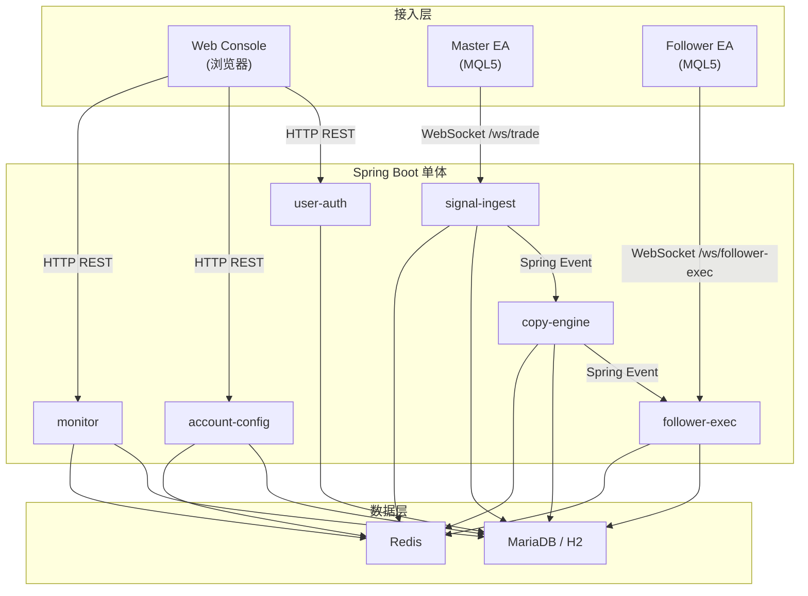

# MT5 Copier Java 后端架构分析报告

> 基于源代码实际阅读，以代码为准。

---

## 1. 整体架构概览

Spring Boot 2.7.18 单体应用（Java 17），内部按模块拆分为 6 个业务模块，具备向微服务演进的潜力。



### 技术栈

| 层 | 技术 |
|---|---|
| Web 框架 | Spring Boot 2.7.18 + Tomcat (embed) |
| WebSocket | Spring WebSocket (`TextWebSocketHandler`) |
| ORM | Spring Data JPA + Hibernate (ddl-auto: update) |
| 缓存/热状态 | Spring Data Redis (`StringRedisTemplate`) |
| 序列化 | Jackson `ObjectMapper` |
| 安全 | Spring Security Crypto (密码加密)；Bearer Token 拦截器（WebSocket 握手） |
| 数据库 | MariaDB (生产) / H2 in-memory (开发) |
| ID 生成 | Redis `INCR` (REDIS_QUEUE 模式) / `AtomicLong` (DATABASE 模式) |
| 构建 | Maven + Lombok |

---

## 2. 六大模块职责与数据通路

### 2.1 user-auth — 用户认证

| 项 | 说明 |
|---|---|
| 入口 | `/api/auth/register`, `/api/auth/login`, `/api/auth/logout`, `/api/auth/me` |
| 数据源 | MariaDB (`platform_users`, `platform_user_sessions`) |
| 读写方式 | **同步** JPA 读写，Cookie-based Session（Token 存 DB，TTL 7 天） |
| 并发模型 | Tomcat 线程池同步处理 |

### 2.2 account-config — 账户与配置

| 项 | 说明 |
|---|---|
| 入口 | `/api/me/*`, `/api/accounts/*` |
| DB 表 | `mt5_accounts`, `risk_rules`, `copy_relations`, `symbol_mappings`, `master_share_configs` |
| Redis 缓存 | `copy:account:binding:{server}:{login}`, `copy:route:master:{id}`, `copy:account:risk:{id}` |
| 写入模式 | **先写 DB → 再刷 Redis 缓存**（`RedisCopyRouteCacheWriter`），读走 Redis-first 策略 |
| 缓存后端切换 | `copier.account-config.route-cache.backend` = `log` / `redis`（`@ConditionalOnProperty`） |
| 预热 | `CopyRouteCacheWarmupRunner` 启动时从 DB 填充全部 route/risk/binding 到 Redis |

**关键数据流：**

```
前端 → AccountConfigController → AccountConfigService → JPA save()
                                                      → CopyRouteCacheWriter.refreshMasterRoute()
                                                        → StringRedisTemplate SET (JSON 序列化)
```

### 2.3 signal-ingest — Master 信号接入

| 项 | 说明 |
|---|---|
| 入口 | WebSocket `/ws/trade`，Bearer Token 握手拦截 |
| Handler | `Mt5TradeWebSocketHandler` extends `TextWebSocketHandler` |
| 核心链路 | `ingest()` → JSON 解析 → `Mt5SignalNormalizer.normalize()` → 去重 → `signalPublisher.publish()` → `applicationEventPublisher.publishEvent(Mt5SignalAcceptedEvent)` |
| 去重 | `Mt5SignalDedupService`，支持 `memory`(ConcurrentHashMap) / `redis` (Redis SETNX + TTL 5min) |
| Session 管理 | `Mt5SessionRegistry`（ConcurrentHashMap 内存），绑定 `server + login` |
| Runtime State | 每次 HELLO/HEARTBEAT/DEAL/ORDER 都更新 `Mt5AccountRuntimeStateStore` |
| 持仓台账 | HELLO/HEARTBEAT 携带 positions 时更新 `Mt5PositionLedgerStore` |

**同步/异步设计：** 整个 `ingest()` 方法在 **WebSocket 线程同步执行**，`publishEvent(Mt5SignalAcceptedEvent)` 是 Spring 同步事件，copy-engine 的 `@EventListener` 会在 **同一线程** 内同步执行。

### 2.4 copy-engine — 跟单决策引擎

| 项 | 说明 |
|---|---|
| 触发 | `@EventListener` 监听 `Mt5SignalAcceptedEvent`（**同步**，在 WebSocket 线程中） |
| 核心方法 | `onMt5SignalAccepted()` → 用 `CopyRouteSnapshotReader` 查路由 → 遍历 followers → `processFollowerSignal()` |
| ID 分配 | `CopyHotPathIdAllocator.nextCommandId()` / `nextDispatchId()` |

#### 两种热路径模式（核心设计）

| | DATABASE 模式 | REDIS_QUEUE 模式 |
|---|---|---|
| Command 持久化 | `executionCommandRepository.save()` 直接 JPA | `hotPathRedisStore.storeCommand()` + `hotPathPersistenceQueue.enqueue()` |
| Dispatch 持久化 | `followerDispatchOutboxRepository.save()` | `hotPathRedisStore.storeDispatch()` + `hotPathPersistenceQueue.enqueue()` |
| ID 生成 | `AtomicLong.incrementAndGet()` | `StringRedisTemplate.opsForValue().increment()` (Redis INCR) |
| 实时推送前提 | DB 行已存在 | **不等待 DB**，Redis 写入后立即推送 |
| 异步落盘 | 无 | `CopyHotPathPersistenceWorker` @Scheduled 每 200ms 批量 drain |
| 去重保护 | `existsByMasterEventIdAndFollowerAccountId` | `SETNX` on `commandDedupKey` |

**REDIS_QUEUE 异步持久化流程：**

```
CopyEngineService.processFollowerSignal()
  → hotPathRedisStore.storeCommand(cmd)         // Redis SET (JSON)
  → hotPathPersistenceQueue.enqueueExecutionCommand(cmd)
      → StringRedisTemplate.opsForList().rightPush(queueKey, envelope)  // Redis LIST RPUSH
  → (同理 dispatch)
  → applicationEventPublisher.publishEvent(FollowerDispatchCreatedEvent)

CopyHotPathPersistenceWorker.drain()            // @Scheduled fixedDelay=200ms
  → stringRedisTemplate.opsForList().leftPop()  // Redis LIST LPOP
  → CopyHotPathPersistenceService.process()     // @Transactional
      → switch(type):
          EXECUTION_COMMAND_UPSERT → executionCommandRepository.save()   // JPA upsert
          FOLLOWER_DISPATCH_UPSERT → followerDispatchOutboxRepository.save()
          SIGNAL_RECORD_UPSERT → signalRecordRepository.save()
          POSITION_LEDGER_RECONCILE → positionLedgerPersistenceService.persist()
```

**Redis 数据结构使用：**

| Redis 类型 | 用途 | 示例 Key |
|---|---|---|
| `STRING` (GET/SET) | 实体 JSON 存储、ID 序列、去重锁、节流标记 | `copy:hot:cmd:{id}`, `copy:hot:seq:cmd` |
| `ZSET` (SortedSet) | 索引（按 ID 排分数） | `copy:hot:idx:cmd:master-event:{eventId}` |
| `LIST` (Queue) | 异步持久化队列 + 死信队列 | `copy:hot:queue`, `copy:hot:dlq` |
| `SET` | runtime-state 索引、position ledger 索引 | `copy:runtime:index` |

### 2.5 follower-exec — Follower 下行执行

| 项 | 说明 |
|---|---|
| 入口 | WebSocket `/ws/follower-exec`，Bearer Token 握手拦截 |
| Handler | `FollowerExecWebSocketHandler` → `FollowerExecWebSocketService` |
| HELLO 流程 | 绑定账户 → 更新 runtime-state → reconcile 持仓 → 查 backlog PENDING dispatches → 逐条推送 |
| ACK/FAIL | 更新 dispatch 状态 → `sendStatusAckAfterCommit()` (注册 `TransactionSynchronization.afterCommit()`) |
| 实时推送协调 | `FollowerDispatchRealtimeCoordinator`，支持 `local` / `redis` (Redis Pub/Sub) |
| 会话管理 | `ConcurrentHashMap<String, WebSocketSession> liveSessions` + `FollowerExecSessionRegistry` |

**关键同步设计：** WebSocket 发送使用 `synchronized(session)` 保证线程安全。

### 2.6 monitor — 监控聚合

| 项 | 说明 |
|---|---|
| 入口 | `/api/monitor/*` |
| 数据来源 | 聚合 runtime-state、signal audit、session registry、command/dispatch 查询 |
| 特点 | **纯读模型**，不产生写操作 |

---

## 3. 数据源组件与读写方式汇总

| 组件 | 存储介质 | 读写方式 | 同步/异步 |
|---|---|---|---|
| `PlatformUserRepository` | MariaDB | Spring Data JPA | 同步 |
| `PlatformUserSessionRepository` | MariaDB | Spring Data JPA | 同步 |
| `Mt5AccountRepository` | MariaDB | Spring Data JPA | 同步 |
| `CopyRelationRepository` | MariaDB | Spring Data JPA | 同步 |
| `RiskRuleRepository` | MariaDB | Spring Data JPA | 同步 |
| `SymbolMappingRepository` | MariaDB | Spring Data JPA | 同步 |
| `MasterShareConfigRepository` | MariaDB | Spring Data JPA | 同步 |
| `Mt5SignalRecordRepository` | MariaDB | Spring Data JPA | 同步 / 异步(REDIS_QUEUE) |
| `ExecutionCommandRepository` | MariaDB | Spring Data JPA | 同步 / 异步(REDIS_QUEUE) |
| `FollowerDispatchOutboxRepository` | MariaDB | Spring Data JPA | 同步 / 异步(REDIS_QUEUE) |
| `Mt5AccountRuntimeStateRepository` | MariaDB | Spring Data JPA | 节流写 (30s 窗口) |
| `Mt5OpenPositionRepository` | MariaDB | Spring Data JPA | 异步(通过 persistenceQueue) |
| `CopyHotPathRedisStore` | Redis | StringRedisTemplate (JSON) | 同步 Redis 操作 |
| `Mt5AccountRuntimeStateStore` | Redis + MariaDB | StringRedisTemplate + JPA | Redis-first 读 + 节流 DB 写 |
| `Mt5PositionLedgerStore` | Redis + MariaDB | StringRedisTemplate + JPA | Redis-first 读 + 异步 DB 写 |
| `Mt5SignalDedupService` | Memory / Redis | ConcurrentMap / SETNX | 同步 |
| `Mt5SessionRegistry` | Memory | ConcurrentHashMap | 同步 |
| `FollowerExecSessionRegistry` | Memory | ConcurrentHashMap | 同步 |

---

## 4. 同步/异步设计分析

### 4.1 整体模型：同步为主

```
[Master EA] --(WebSocket)--> [Tomcat WebSocket Thread]
    → Mt5TradeWebSocketHandler.handleTextMessage()        // 同步
    → Mt5SignalIngestService.ingest()                     // 同步
    → ApplicationEventPublisher.publishEvent()            // 同步 Spring Event
    → CopyEngineService.onMt5SignalAccepted()             // 同步 @EventListener
        → for each follower: processFollowerSignal()      // 同步循环
            → (REDIS_QUEUE) Redis SET + LIST RPUSH        // 同步 Redis I/O
            → (DATABASE) JPA save()                       // 同步 DB I/O
        → publishEvent(FollowerDispatchCreatedEvent)      // 同步
    → FollowerDispatchRealtimeCoordinator
        .onFollowerDispatchCreated()                      // @TransactionalEventListener AFTER_COMMIT
        → tryPushPendingDispatch()                        // 同步 WebSocket send
```

> [!IMPORTANT]
> **从 Master EA 发送信号到 Follower EA 收到 DISPATCH，整条热路径都在 WebSocket 线程同步执行**（REDIS_QUEUE 模式下仅 DB 持久化是异步的），这是延迟最小化的设计选择。

### 4.2 唯一的异步组件

| 异步机制 | 实现 | 用途 |
|---|---|---|
| `@Scheduled(fixedDelay=200ms)` | `CopyHotPathPersistenceWorker.drain()` | 从 Redis LIST drain 消息 → JPA upsert 到 DB |
| `@TransactionalEventListener(AFTER_COMMIT)` | `FollowerDispatchRealtimeCoordinator` | 事务提交后推送 dispatch（但实际上 REDIS_QUEUE 模式无活跃事务时退化为同步） |
| `TransactionSynchronization.afterCommit()` | `FollowerExecWebSocketService.sendStatusAckAfterCommit()` | ACK/FAIL 状态确认的 WebSocket 回复 |

### 4.3 线程模型

| 线程 | 来源 | 职责 |
|---|---|---|
| Tomcat NIO 线程 | Spring Boot 内嵌 Tomcat | HTTP REST 请求处理 |
| WebSocket 线程 | Spring WebSocket | Master/Follower EA 消息处理 + copy-engine 信号处理 |
| Spring `@Scheduled` 线程 | `TaskScheduler` 默认单线程池 | `CopyHotPathPersistenceWorker.drain()` |

---

## 5. 端到端信号延迟路径分析

以 **REDIS_QUEUE 模式** 为例，一个 DEAL 信号的关键路径：

| 步骤 | 操作 | 预估耗时 |
|---|---|---|
| 1 | WebSocket 接收 + JSON 解析 | ~0.1ms |
| 2 | 信号标准化 + 去重 (Redis SETNX) | ~0.5ms |
| 3 | signal audit 写 Redis | ~0.5ms |
| 4 | runtime-state 写 Redis | ~0.5ms |
| 5 | `publishEvent(Mt5SignalAcceptedEvent)` → copy-engine | ~0 (同步调用) |
| 6 | 读 account-binding (Redis GET) | ~0.3ms |
| 7 | 读 master route (Redis GET) | ~0.3ms |
| 8 | 每个 follower: 读 risk (Redis GET) + runtime-state (Redis GET) | ~0.6ms × N |
| 9 | Command: Redis SET + ZSET ADD × 多个索引 + LIST RPUSH | ~1.5ms |
| 10 | Dispatch: Redis SET + ZSET ADD × 多个索引 + LIST RPUSH | ~1.5ms |
| 11 | `publishEvent(FollowerDispatchCreatedEvent)` | ~0 |
| 12 | WebSocket send DISPATCH to Follower EA | ~0.1ms |
| **总计 (单 follower)** | | **~5–6ms** |
| **总计 (N followers)** | | **~4 + 3.5×N ms** |

---

## 6. TPS/QPS 估算（个人电脑）

### 6.1 假设的硬件环境

| 参数 | 典型个人电脑 |
|---|---|
| CPU | 4–8 核 (i5/i7/Ryzen 5) |
| RAM | 16–32 GB |
| Redis | 本地 localhost |
| MariaDB / H2 | 本地 localhost |
| JDK | 17 |
| 网络 | 全部 localhost，无网络延迟 |

### 6.2 瓶颈分析

| 瓶颈点 | 分析 |
|---|---|
| **WebSocket 线程数** | Spring Boot 默认 Tomcat WebSocket 线程有限（通常 10–200 个连接），但 copy-trade 场景连接数很少（几个 EA） |
| **信号处理串行化** | `@EventListener` 同步，单个信号的处理占用一个 WebSocket 线程直到完成 |
| **Redis 操作数** | REDIS_QUEUE 模式下单个信号 per follower 约 10–15 次 Redis 命令（无 pipeline） |
| **DB 写入** | DATABASE 模式是同步瓶颈；REDIS_QUEUE 模式由 Worker 异步 drain（200ms 间隔，batch 200） |
| **Spring `@Scheduled` 单线程** | Worker drain 是默认单线程，200ms × 200 条 = **理论异步落盘峰值约 1000 条/秒** |

### 6.3 TPS 估算（信号处理吞吐量）

> **TPS 定义**：每秒可处理的 Master 交易信号数（DEAL/ORDER），一个信号可能扇出 N 个 follower command + dispatch。

| 场景 | 模式 | 预估 TPS | 说明 |
|---|---|---|---|
| **单 Master, 1 Follower** | DATABASE | **80–150 TPS** | 瓶颈在 JPA save() 同步写 DB（每信号 ~2 次 INSERT） |
| **单 Master, 1 Follower** | REDIS_QUEUE | **200–400 TPS** | 瓶颈在 Redis 命令数（~15 次/信号，本地 Redis ~10K QPS 可用） |
| **单 Master, 10 Followers** | DATABASE | **15–30 TPS** | 每信号扇出 10 个 command + 10 个 dispatch = 20 次 JPA save |
| **单 Master, 10 Followers** | REDIS_QUEUE | **50–100 TPS** | 每信号约 150 次 Redis 操作，Redis 仍有余量但序列化/反序列化成为瓶颈 |
| **多 Master 并发** | REDIS_QUEUE | **100–300 TPS** | 每个 WebSocket 连接独立线程，可并行处理 |

### 6.4 QPS 估算（HTTP API 查询吞吐量）

| API 类型 | 预估 QPS | 说明 |
|---|---|---|
| `/api/auth/*` (登录/注册) | **200–500 QPS** | 简单 DB 查询 + BCrypt 验证 |
| `/api/me/accounts` (配置 CRUD) | **300–800 QPS** | JPA 读 + Redis 缓存刷新 |
| `/api/monitor/accounts` (监控概览) | **500–1500 QPS** | Redis-first 读模型，命中缓存时非常快 |
| `/api/monitor/account/{id}/detail` (监控详情) | **200–600 QPS** | 聚合多个子查询 (runtime-state + commands + dispatches) |

### 6.5 总结

| 指标 | DATABASE 模式 | REDIS_QUEUE 模式 |
|---|---|---|
| **信号处理 TPS (1 follower)** | 80–150 | 200–400 |
| **信号处理 TPS (10 followers)** | 15–30 | 50–100 |
| **HTTP API QPS (缓存命中)** | 200–500 | 500–1500 |
| **端到端信号延迟 (1 follower)** | 10–20ms | 5–6ms |
| **异步落盘吞吐** | N/A | ~1000 条/秒 |

> [!NOTE]
> **实际业务场景中**，MT5 跟单的信号频率通常在 **每秒 1–10 笔** 的量级（人工交易或 EA 策略交易），远低于系统上限。因此该系统在个人电脑上运行**完全没有性能瓶颈**，REDIS_QUEUE 模式下端到端延迟可控制在 **10ms 以内**。

> [!TIP]
> 如果追求极致吞吐，主要优化方向是：
> 1. Redis Pipeline 批量化（当前逐条调用）
> 2. `@EventListener` 改为 `@Async` 异步事件
> 3. `@Scheduled` Worker 改多线程或增配 `TaskScheduler` 线程池
> 4. 对 follower 列表的循环处理改为并行流
