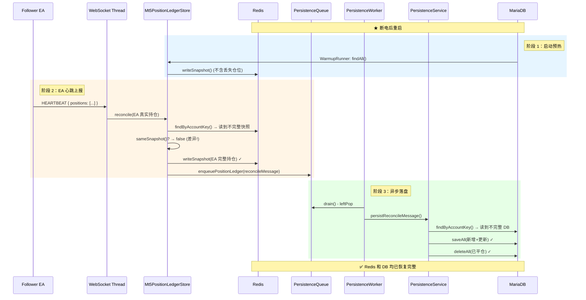

# Position Ledger 断电恢复机制 — 代码路径分析

## 结论

> [!IMPORTANT]
> **是的，代码已经完整实现了你描述的恢复机制。** 断电丢失的仓位会在 EA 下次 HELLO/HEARTBEAT 上报持仓时，通过 `reconcile()` 的差异比对自动补回 Redis 和 DB。

---

## 故障场景还原

```
时间线：
  t0: EA 下单 → copy-engine 写 Redis 热状态 ✓  → 入队异步持久化 ✓
  t1: @Scheduled Worker 尚未 drain 到这条消息
  t2: ★ 断电 → Redis 数据丢失，DB 中也没有这条仓位
  t3: 重启 → WarmupRunner 从 DB 恢复仓位到 Redis（缺失 t0 的仓位）
  t4: EA 发送 HEARTBEAT，携带当前真实持仓（包含 t0 的仓位）
  t5: reconcile() 发现差异 → 写 Redis + 入队 DB 持久化 → 仓位恢复 ✓
```

---

## 代码路径逐步追踪

### 阶段 1：启动预热 (t3)

[Mt5PositionLedgerStore.WarmupRunner](file:///d:/repo/Copy_trader_MT5/copier_v0/src/main/java/com/zyc/copier_v0/modules/monitor/service/Mt5PositionLedgerStore.java#L306-L335)

```java
@Override
public void run(ApplicationArguments args) {
    if (!properties.isWarmupOnStartup()) { return; }
    // 从 DB 读取全部仓位，按 accountKey 分组写入 Redis
    repository.findAllByOrderByAccountKeyAscPositionKeyAsc().stream()
        .collect(Collectors.groupingBy(
            Mt5OpenPositionEntity::getAccountKey, LinkedHashMap::new, Collectors.toList()))
        .forEach((accountKey, rows) -> store.writeSnapshot(
            accountKey,
            rows.stream().map(store::toSnapshot).toList()
        ));
}
```

**结果：** Redis 中的仓位 = DB 中的仓位（不含 t0 丢失的那条）。

---

### 阶段 2：EA 心跳上报持仓 (t4)

以 Follower EA 为例，[FollowerExecWebSocketService.handleHeartbeat()](file:///d:/repo/Copy_trader_MT5/copier_v0/src/main/java/com/zyc/copier_v0/modules/copy/followerexec/service/FollowerExecWebSocketService.java#L176-L205)：

```java
private void handleHeartbeat(String sessionId, JsonNode payload) {
    // ... 更新 runtime-state ...

    if (positionLedgerStore.hasPositionsSnapshot(payload)) {  // ← payload 带 positions 数组
        positionLedgerStore.reconcile(
            followerAccount.getId(),
            followerAccount.getMt5Login(),
            followerAccount.getServerName(),
            accountKey,
            positionLedgerStore.extractFromPayload(payload, heartbeatAt),  // ← 解析 EA 真实持仓
            heartbeatAt
        );
    }
}
```

Master EA 的 HELLO/HEARTBEAT 同理，在 [Mt5SignalPublisher.publish()](file:///d:/repo/Copy_trader_MT5/copier_v0/src/main/java/com/zyc/copier_v0/modules/signal/ingest/service/Mt5SignalIngestService.java) 链路中也会调用 `positionLedgerStore.reconcile()`。

---

### 阶段 3：核心 — reconcile() 差异比对 (t5)

[Mt5PositionLedgerStore.reconcile()](file:///d:/repo/Copy_trader_MT5/copier_v0/src/main/java/com/zyc/copier_v0/modules/monitor/service/Mt5PositionLedgerStore.java#L58-L86)：

```java
public void reconcile(Long accountId, Long login, String server,
                       String accountKey,
                       List<Mt5OpenPositionSnapshot> positions,   // ← EA 刚上报的真实持仓
                       Instant observedAt) {
    List<Mt5OpenPositionSnapshot> normalized = normalize(positions, observedAt);

    // ① 读取 Redis 中当前快照（启动时已从 DB 预热，但缺少丢失的仓位）
    List<Mt5OpenPositionSnapshot> current = findByAccountKey(accountKey);

    // ② 逐字段比对：positionKey, sourcePositionId, symbol, volume, price 等
    if (sameSnapshot(current, normalized)) {
        return;  // 完全一致则跳过
    }

    // ③ 不一致 → 以 EA 上报为准，覆写 Redis
    writeSnapshot(accountKey, normalized);

    // ④ 入队异步持久化到 DB
    Mt5PositionLedgerReconcileMessage message = new Mt5PositionLedgerReconcileMessage();
    message.setAccountId(accountId);
    message.setPositions(normalized);
    // ...
    persistenceQueue.enqueuePositionLedger(message);  // ← Redis LIST RPUSH
}
```

> [!NOTE]
> `findByAccountKey()` 是 **Redis-first**：先查 Redis，miss 则查 DB 再回填 Redis。启动预热后 Redis 一定有数据（虽然不完整），所以这里读到的是 DB 恢复的不完整快照。

**比对逻辑** (`sameSnapshot()`): 按 positionKey 逐条比较 `sourcePositionId`, `sourceOrderId`, `masterPositionId`, `masterOrderId`, `symbol`, `volume`, `priceOpen`, `sl`, `tp`, `commentText`。任何一项不同或数量不同，即判定为"不一致"。

---

### 阶段 4：异步持久化到 DB

入队路径：`CopyHotPathPersistenceQueue.enqueue()` → Redis LIST RPUSH

消费路径：`CopyHotPathPersistenceWorker.drain()` → `CopyHotPathPersistenceService.process()`

最终落地：[Mt5PositionLedgerPersistenceService.persistReconcileMessage()](file:///d:/repo/Copy_trader_MT5/copier_v0/src/main/java/com/zyc/copier_v0/modules/monitor/service/Mt5PositionLedgerPersistenceService.java#L22-L57)

```java
@Transactional
public void persistReconcileMessage(Mt5PositionLedgerReconcileMessage message) {
    // ① 读取 DB 中该账户的全部现有仓位
    List<Mt5OpenPositionEntity> existing = repository
        .findByAccountKeyOrderByPositionKeyAsc(message.getAccountKey());
    Map<String, Mt5OpenPositionEntity> existingByKey = existing.stream()
        .collect(Collectors.toMap(Mt5OpenPositionEntity::getPositionKey, ...));

    List<Mt5OpenPositionEntity> toSave = new ArrayList<>();
    for (Mt5OpenPositionSnapshot snapshot : message.getPositions()) {
        // ② 按 positionKey 做 diff
        Mt5OpenPositionEntity entity = existingByKey.remove(snapshot.getPositionKey());
        if (entity == null) {
            entity = new Mt5OpenPositionEntity();  // ← 新仓位，DB 里没有，创建新行
        }
        // ③ 用 EA 上报的值覆盖所有字段
        entity.setPositionKey(snapshot.getPositionKey());
        entity.setSourcePositionId(snapshot.getSourcePositionId());
        // ... 全部字段赋值 ...
        toSave.add(entity);
    }

    // ④ 批量保存（新增 + 更新）
    repository.saveAll(toSave);

    // ⑤ DB 中有但 EA 不再持有的仓位 → 删除（已平仓）
    if (!existingByKey.isEmpty()) {
        repository.deleteAll(existingByKey.values());
    }
}
```

> [!TIP]
> 这个 `persistReconcileMessage()` 是一个 **全量 diff + upsert + delete** 操作，以 EA 上报的仓位为唯一真源，实现了：
> - 丢失的仓位会被 **重新 INSERT**
> - 已有的仓位会被 **UPDATE** 为最新值
> - EA 已经平仓的仓位会被 **DELETE**

---

## 完整恢复链路图



---

## 边界情况分析

| 场景 | 是否覆盖 | 代码位置 |
|---|---|---|
| Redis 丢失 + DB 也没有某仓位 | ✅ EA 心跳补回 | `reconcile()` → `sameSnapshot()` == false → 重写 |
| EA 平仓了某仓位，但 DB 残留 | ✅ 删除残留 | `persistReconcileMessage()` 中 `deleteAll(existingByKey.values())` |
| Redis 正常但 DB 落后 | ✅ Worker 追平 | `@Scheduled` drain 正常工作 |
| Worker drain 再次断电 | ✅ 下次心跳再补 | EA 持续上报，每次都触发 reconcile |
| 持久化队列本身丢失 (Redis LIST) | ✅ 下次心跳再补 | reconcile 不依赖队列历史，只看当前 Redis 快照 vs EA 上报 |

> [!CAUTION]
> **唯一不可恢复的窗口**：如果断电后 EA 也永远不再发送 HELLO/HEARTBEAT（例如 EA 也关闭了），则仓位丢失无法通过此机制恢复。恢复依赖于 **EA 重新上线并上报持仓**。
